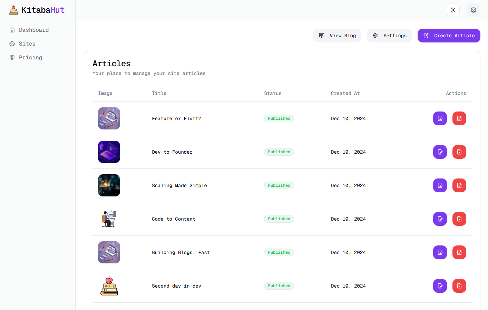

# KitabaHut

A user-friendly blog platform where users can create personal blogs and publish articles. Each blog is public, and users can share their articles with the world.

## ✨ [App Demo](https://kitabahut.vercel.app)




## Features

- **User Authentication** with Clerk
- **Create and manage blogs** with multiple articles
- **Publicly viewable blogs** for sharing
- **Responsive UI** with TailwindCSS
- **Secure file uploads** using Uploadthing
- **Form validation** with Zod
- **Backend** powered by Supabase and Prisma

## Tech Stack

- **Frontend**: Next.js, TailwindCSS, Shadcn UI, React
- **Authentication**: Clerk
- **Database**: Supabase, Prisma
- **File Uploads**: Uploadthing
- **Validation**: Zod

## Getting Started

### 1. Clone the repository

```bash
git clone https://github.com/MoSaif00/KitabaHut.git
```

### 2. Install dependencies

```bash
cd KitabaHut-master
npm install --legacy-peer-deps #needed for nextjs15 and react
```

### 3. Set up environment variables

Create a .env.local file and add the following:

```bash
# Clerk
NEXT_PUBLIC_CLERK_PUBLISHABLE_KEY=<your-clerk-publishable-key>
CLERK_SECRET_KEY=<your-clerk-secret-key>
NEXT_PUBLIC_CLERK_SIGN_IN_URL=/sign-in
NEXT_PUBLIC_CLERK_SIGN_UP_URL=/sign-up
NEXT_PUBLIC_CLERK_AFTER_SIGN_IN_URL=/dashboard
NEXT_PUBLIC_CLERK_AFTER_SIGN_UP_URL=/dashboard
WEBHOOK_SECRET=<your-clerk-webhook-secret> # for user.created and user.updated


# Supabase
DATABASE_URL=<your-database-url>
DIRECT_URL=<your-direct-url>

# Upload Thing
UPLOADTHING_TOKEN=<your-uploadthing-token>

# Stripe
STRIPE_SECRET_KEY=<your-stripe-secret-key>
STRIPE_PRICE_ID=<your-stripe-price-id>
STRIPE_WEBHOOK_SECRET=<your-stripe-webhook-secret>
```

### 4. Run Prisma for database

```bash
npx prisma init  #Initiate Prisma
prisma db push   #Push Database Schemas
```

### 5. Run the development server

```bash
npm run dev
```
