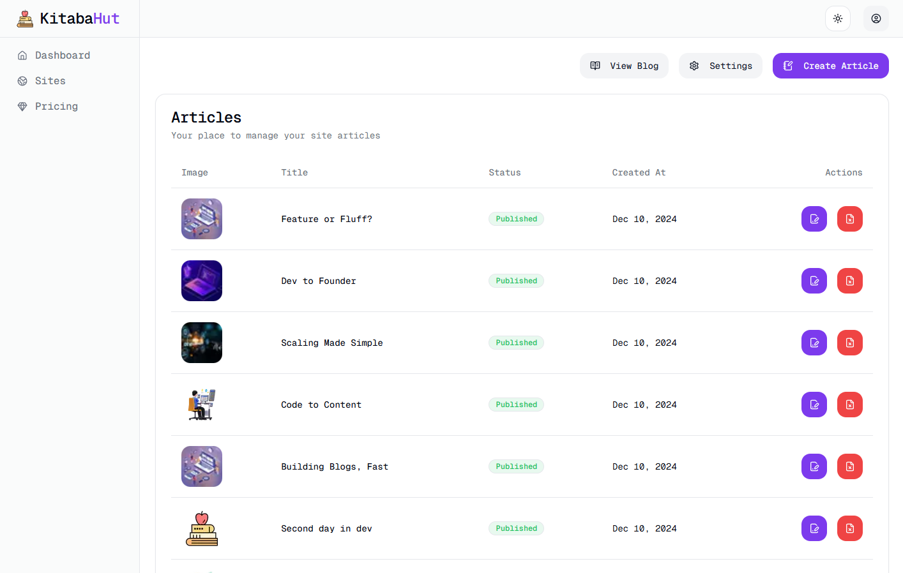
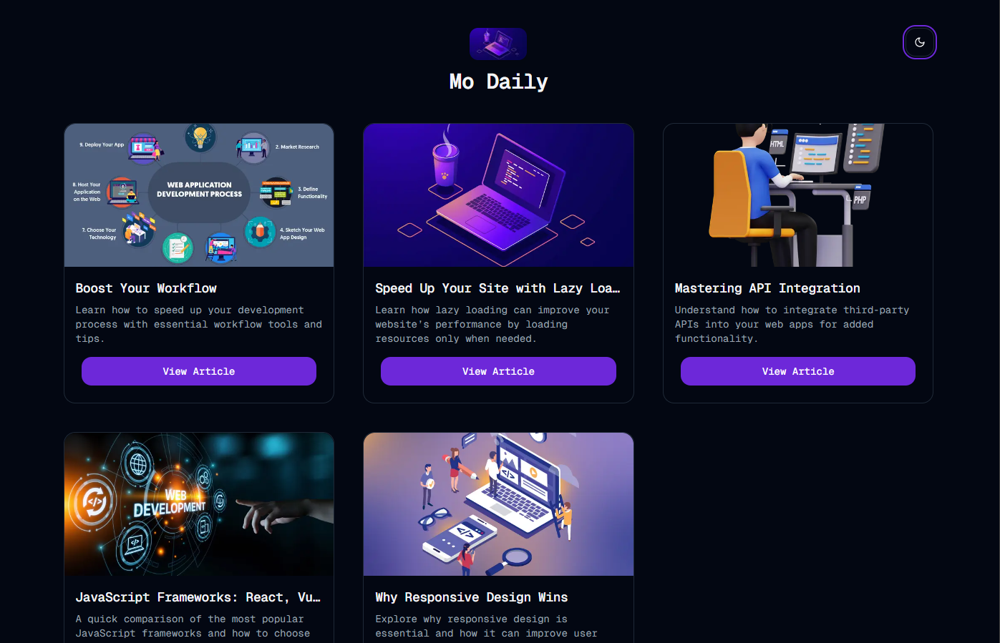

# KitabaHut

A user-friendly blog platform where users can create personal blogs and publish articles. Each blog is public, and users can share their articles with the world.

## ✨ [App Demo](https://kitabahut.vercel.app)





## Features

- **User Authentication** with Clerk
- **Create and manage blogs** with multiple articles
- **Publicly viewable blogs** for sharing
- **Responsive UI** with TailwindCSS
- **Secure file uploads** using Uploadthing
- **Form validation** with Zod
- **Backend** powered by Supabase and Prisma

## Tech Stack

- **Frontend**: Next.js, TailwindCSS, Shadcn UI, React
- **Authentication**: Clerk
- **Database**: Supabase, Prisma
- **File Uploads**: Uploadthing
- **Validation**: Zod

## Getting Started

### 1. Clone the repository

```bash
git clone https://github.com/MoSaif00/KitabaHut.git
```

### 2. Install dependencies

```bash
cd KitabaHut
npm install
```

> An `.npmrc` with `legacy-peer-deps=true` is included so install works cleanly with React 19 + `novel`. You no longer need `--legacy-peer-deps` manually.

### 3. Set up environment variables

Copy `.env.example` to `.env.local` and fill in the values.

**Local vs production Clerk keys (important)**

| Environment | Keys | Works on |
| --- | --- | --- |
| Local (`npm run dev`) | Development: `pk_test_` / `sk_test_` | `localhost` |
| Vercel production | Production: `pk_live_` / `sk_live_` | your real domain + Clerk DNS |

Using `pk_live_` on localhost causes: `Failed to load Clerk JS` from `clerk.your-domain/...`.

```bash
# Clerk — LOCAL: Development instance keys from https://dashboard.clerk.com (toggle → Development)
NEXT_PUBLIC_CLERK_PUBLISHABLE_KEY=pk_test_...
CLERK_SECRET_KEY=sk_test_...
NEXT_PUBLIC_CLERK_SIGN_IN_URL=/sign-in
NEXT_PUBLIC_CLERK_SIGN_UP_URL=/sign-up
NEXT_PUBLIC_CLERK_SIGN_IN_FORCE_REDIRECT_URL=/dashboard
NEXT_PUBLIC_CLERK_SIGN_UP_FORCE_REDIRECT_URL=/dashboard
CLERK_WEBHOOK_SIGNING_SECRET=<dev-webhook-secret>

# Supabase
DATABASE_URL=<your-database-url>
DIRECT_URL=<your-direct-url>

# Upload Thing
UPLOADTHING_TOKEN=<your-uploadthing-token>

# Stripe
STRIPE_SECRET_KEY=<your-stripe-secret-key>
STRIPE_PRICE_ID=<your-stripe-price-id>
STRIPE_WEBHOOK_SECRET=<your-stripe-webhook-secret>
```

**Clerk production checklist (Vercel only)**

1. Clerk Dashboard → switch to **Production**.
2. For a `*.vercel.app` host you **cannot** use DNS CNAMEs. Enable a Frontend API proxy instead:
   - Clerk Dashboard → **Domains** → Frontend API → **Set proxy configuration**
   - Proxy URL: `https://kitabahut.vercel.app/__clerk` (your real production URL)
   - In Vercel env (Config): `NEXT_PUBLIC_CLERK_PROXY_URL=https://kitabahut.vercel.app/__clerk`
   - This repo already enables `frontendApiProxy` in `middleware.ts` and matches `/__clerk/(.*)`.
3. Prefer a custom domain you control long-term (better cookies/DNS); then you can use CNAME instead of proxy.
4. Put `pk_live_` / `sk_live_` in **Vercel env vars**, not in local `.env.local` for day-to-day work.
5. Create a Production webhook → `https://your-domain/api/webhook` (`user.created`, `user.updated`).
6. Remove deprecated `NEXT_PUBLIC_CLERK_AFTER_SIGN_*` / `WEBHOOK_SECRET` if still present.

### 4. Run Prisma for database

```bash
npx prisma init  #Initiate Prisma
prisma db push   #Push Database Schemas
```

### 5. Run the development server

```bash
npm run dev
```
